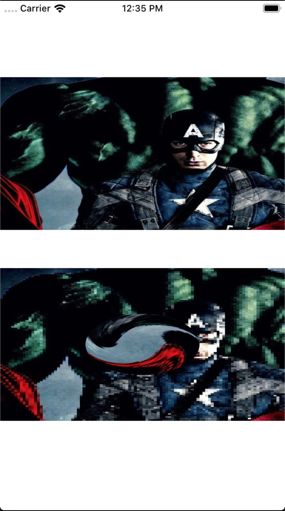

# LGLKit
OpenGL面向对象封装, 支持 iOS/MacOS, MacOS 下需要安装 glfw, 持续改进中...

简单的渲染代码

```objc
static NSString *vertexShaderString(void) {
    NSString *path = @"/Volumes/Sam/音视频/opengl/opengl-lesson-review/opengl-lesson-review/cube/cube_vert.glsl";
    NSString *src = [NSString stringWithContentsOfFile:path encoding:NSUTF8StringEncoding error:nil];
    return src;
}

static NSString *fragmentShaderString(void) {
    NSString *path = @"/Volumes/Sam/音视频/opengl/opengl-lesson-review/opengl-lesson-review/cube/cube_frag.glsl";
    NSString *src = [NSString stringWithContentsOfFile:path encoding:NSUTF8StringEncoding error:nil];
    return src;
}

+ (void)test {
    LGWindow *w = [[LGWindow alloc] initWithSize:CGSizeMake(600, 600) title:@"cube"];
    w.rgba = 0x172749ff;
    w.mask = GL_COLOR_BUFFER_BIT | GL_DEPTH_BUFFER_BIT;
    
    LGVertexArrayObject *vao = [[LGVertexArrayObject alloc] init];
    LGVertexBufferObject *vbo = [[LGVertexBufferObject alloc]
                                 initWithVertexArray:LGLfloatArrayPack(vertexes, sizeof(vertexes)/sizeof(float))
                                 lineWidth:@[@3, @2]];
    [vao addVertexBufferObject:vbo];
    
    LGVertexShader *vs = [[LGVertexShader alloc] initWithString:vertexShaderString()];
    LGFragmentShader *fs = [[LGFragmentShader alloc] initWithString:fragmentShaderString()];
    LGProgram *program = [[LGProgram alloc] initWithVertexShader:vs fragmentShader:fs];
    
    LGTexture *t = [[LGTexture alloc] initWithPath:@"/Volumes/Sam/音视频/opengl/opengl-lesson-review/opengl-lesson-review/abc.png"];
    [program setShaderVariable:^(GLuint prog) {
        glUniform1i(glGetUniformLocation(prog, "texture1"), 0);
        t.textureUnit = 0;
    }];
    
    [w render:^{
        [program use];
        [program activeTextures:@[t]];
        [vao draw];
    }];
}
```
基于封装实现的一个 gpuimage , 可以多个滤镜叠加

```objc

- (void)viewDidLoad {
    [super viewDidLoad];
    self.view.backgroundColor = [UIColor whiteColor];
    UIImage *i = [UIImage imageNamed:@"cap"];
    UIImageView *v = [[UIImageView alloc] initWithFrame:CGRectMake(0, 100, self.view.frame.size.width, 200)];
    v.image = i;
    [self.view addSubview:v];
    EAGLContext  *context = [[EAGLContext alloc] initWithAPI:kEAGLRenderingAPIOpenGLES3];
    LGProcessor *p = [[LGProcessor alloc] initWithContext:context];
    
    NSString *f1Shader = @"#version 300 es\
                            precision mediump float;\
                            uniform sampler2D texture1;\
                            in vec2 texcoord;\
                            out vec4 fragColor;\
                            const float step_size = 0.01;\
                            void main() {\
                                fragColor = texture(texture1, vec2(floor(texcoord.x/step_size) * step_size, floor(texcoord.y/step_size) * step_size));\
                            }";
    LGFilter *f1 = [[LGFilter alloc] initWithFragmentShader:f1Shader];
    
    NSString *f2Shader = @"#version 300 es\
                           precision mediump float;\
                           uniform sampler2D texture1;\
                           in vec2 texcoord;\
                           out vec4 fragColor;\
                           const float ud = 80.0;\
                           void main() {\
                               float radius = 0.2;\
                               vec2 origin = vec2(0.5, 0.5);\
                               vec2 xy = texcoord;\
                               vec2 dxy = xy - origin;\
                               float dst = length(dxy);\
                               float angle = atan(dxy.x, dxy.y) + radians(ud) * (1.0 - (dst/radius) * (dst/radius));\
                               if (dst <= radius) {\
                                   xy = vec2(radius, radius) + dst * vec2(cos(angle), sin(angle));\
                               }\
                               fragColor = texture(texture1, xy);\
                           }";
    LGFilter *f2 =  [[LGFilter alloc] initWithFragmentShader:f2Shader];
    
    [p addFilter:f1];
    [p addFilter:f2];
    UIImage *i1 = [UIImage imageNamed:@"cap"];
    i1 = [p processImage:i1];

    UIImageView *v1 = [[UIImageView alloc] initWithFrame:CGRectMake(0, 350, self.view.frame.size.width, 200)];
    v1.image = i1;
    [self.view addSubview:v1];

}


```
马赛克 + 旋转滤镜


